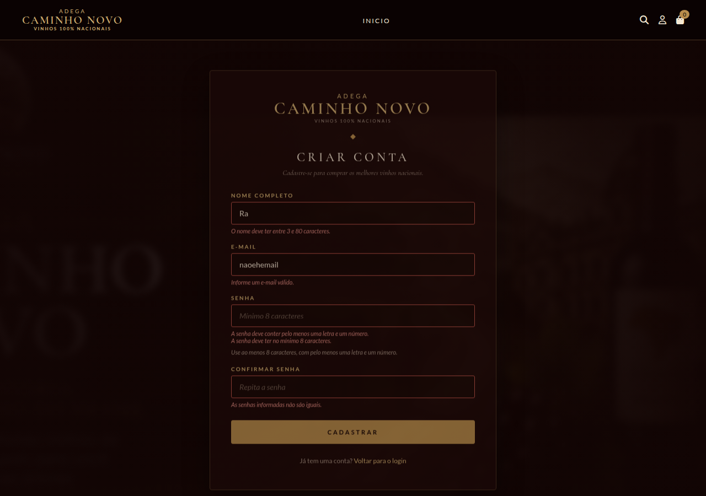
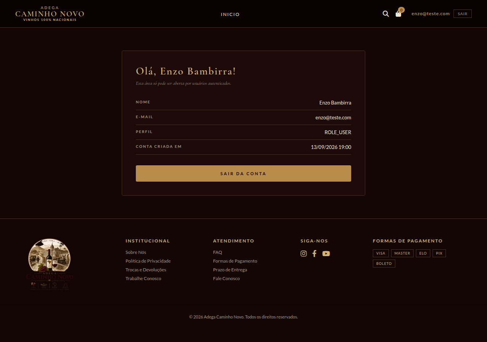

# Adega Caminho Novo — Login e Cadastro de Usuários

Aplicação web desenvolvida com **Spring Boot + Thymeleaf** para a **Atividade 02** da disciplina
*Desenvolvimento e Integração de Aplicações Web* (PUC Minas).

O sistema implementa **autenticação e cadastro de usuários** integrados ao site da Adega Caminho
Novo, uma loja fictícia de vinhos 100% nacionais. As telas de login, cadastro e recuperação de
senha seguem a mesma identidade visual do site: tema escuro em tons de vinho e dourado, com
as fontes Cormorant Garamond nos títulos e Lato nos textos e formulários.

---

## 👥 Dupla

- Enzo Bambirra
- Raiany Morais Ribeiro

---

## 🛠️ Tecnologias

| Recurso | Versão |
| --- | --- |
| Java | 25 |
| Spring Boot | 4.1.1 |
| Maven | wrapper incluso (`./mvnw`) |
| Empacotamento | jar |

**Dependências principais:** Spring Web MVC, Thymeleaf, Spring Security, Spring Data JPA,
Bean Validation e banco H2.

---

## 🖼️ Telas

### Login (`/login`)


### Cadastro (`/register`)


As validações são exibidas abaixo de cada campo, com o campo destacado:



### Recuperação de senha (`/recoverpassword`)


### Área restrita (`/minha-conta`)

Acessível apenas com sessão autenticada:



### Home da loja (`/`)


---

## 🔐 Como a autenticação funciona

- O login é feito pelo **e-mail** (`usernameParameter("email")`), não por um nome de usuário.
- As senhas **nunca são gravadas em texto puro**: o `UsuarioService` aplica **BCrypt**
  (`BCryptPasswordEncoder`) antes de salvar, e o banco guarda apenas o hash.
- O `UsuarioDetailsService` liga o Spring Security à tabela `usuario`, carregando o usuário
  pelo e-mail informado.
- Rotas públicas e protegidas são declaradas no `SecurityConfig`. Qualquer rota não listada
  como pública exige sessão autenticada — é o caso de `/minha-conta`.
- O envio do formulário de login é tratado pelo **próprio Spring Security**; por isso não
  existe um `POST /login` no controller.
- O logout é feito por `POST /logout` (com token CSRF gerado automaticamente pelo Thymeleaf).

### Validações do cadastro

O formulário de cadastro (`POST /register`) impede:

- campos obrigatórios vazios;
- nome com menos de 3 caracteres;
- e-mail em formato inválido;
- senha com menos de 8 caracteres ou sem pelo menos uma letra e um número;
- senha e confirmação diferentes;
- e-mail já cadastrado (comparação sem diferenciar maiúsculas de minúsculas).

Os erros aparecem abaixo do campo correspondente, e o campo é destacado em vermelho.

---

## 🌐 Endpoints

| Método | Endpoint | Acesso | Descrição |
| --- | --- | --- | --- |
| `GET` | `/login` | público | Exibe a tela de login |
| `GET` | `/register` | público | Exibe a tela de cadastro |
| `POST` | `/register` | público | Processa o cadastro e redireciona para `/login?cadastro=ok` |
| `GET` | `/recoverpassword` | público | Exibe a tela de recuperação de senha |
| `POST` | `/recoverpassword` | público | Processa a solicitação de recuperação |
| `POST` | `/logout` | autenticado | Encerra a sessão |
| `GET` | `/` e `/home` | público | Página inicial da loja |
| `GET` | `/minha-conta` | **autenticado** | Área restrita com os dados do usuário logado |
| `GET` | `/h2-console` | público (dev) | Console do banco H2 |

> O `POST /login` não aparece na lista porque é interceptado pelo filtro do Spring Security,
> conforme permitido no enunciado da atividade.

---

## ▶️ Como executar

Pré-requisitos: **JDK 25** instalado (`java -version`). O Maven não precisa estar instalado —
o projeto traz o wrapper.

```bash
# clonar e entrar na pasta
git clone https://github.com/Raiany046/Site_de_VinhosDIAW.git
cd Site_de_VinhosDIAW

# rodar
./mvnw spring-boot:run
```

No Windows, use `mvnw.cmd spring-boot:run`.

A aplicação sobe em **http://localhost:8080**.

Para rodar os testes:

```bash
./mvnw test
```

Para gerar o jar executável:

```bash
./mvnw clean package
java -jar target/caminho-novo-0.0.1-SNAPSHOT.jar
```

### Roteiro rápido de teste

1. Abra <http://localhost:8080> — a home da loja aparece sem exigir login.
2. Clique no ícone de usuário (ou vá em <http://localhost:8080/register>) e crie uma conta.
3. Você é redirecionado ao login com a mensagem de cadastro concluído.
4. Faça login: o sistema leva você para `/minha-conta`, a área protegida.
5. Tente abrir <http://localhost:8080/minha-conta> em uma janela anônima — o Spring Security
   redireciona para `/login`.
6. Clique em **SAIR** para encerrar a sessão.

---

## ⚙️ Configuração do ambiente

Toda a configuração fica em `src/main/resources/application.properties`.

### Banco de dados

O projeto usa **H2 em arquivo**, então **não é necessário instalar nenhum banco**. Os dados
ficam em `./data/adega.mv.db`, que está no `.gitignore` — os cadastros continuam valendo entre
reinícios da aplicação, mas não vão para o repositório.

O schema é criado automaticamente pelo Hibernate (`spring.jpa.hibernate.ddl-auto=update`).

### Console do H2

Com a aplicação rodando, acesse <http://localhost:8080/h2-console> para inspecionar a tabela
`USUARIO` e confirmar que as senhas estão gravadas como hash BCrypt (começam com `$2a$`).

| Campo | Valor |
| --- | --- |
| JDBC URL | `jdbc:h2:file:./data/adega;AUTO_SERVER=TRUE` |
| User Name | `sa` |
| Password | *(vazio)* |

> O console do H2 está liberado apenas para facilitar a correção. Em um ambiente real ele
> deve ficar desativado.

### Credenciais

O projeto **não contém senhas, tokens ou chaves de API** no código-fonte. As credenciais do
banco são lidas de variáveis de ambiente, com um valor padrão para desenvolvimento:

```properties
spring.datasource.username=${DB_USER:sa}
spring.datasource.password=${DB_PASSWORD:}
```

Para usar outras credenciais, basta definir `DB_USER` e `DB_PASSWORD` no ambiente antes de
subir a aplicação.

---

## 📁 Estrutura do projeto

```text
Site_de_VinhosDIAW/
├── pom.xml
├── mvnw / mvnw.cmd            # Maven wrapper
└── src/
    ├── main/
    │   ├── java/com/adega/caminhonovo/
    │   │   ├── application/   # classe principal (AdegaCaminhoNovoApplication)
    │   │   ├── config/        # SecurityConfig (filtros, BCrypt, form login)
    │   │   ├── controller/    # AuthController e SiteController
    │   │   ├── dto/           # RegistroForm (validações do cadastro)
    │   │   ├── model/         # Usuario (entidade JPA)
    │   │   ├── repository/    # UsuarioRepository
    │   │   └── service/       # UsuarioService e UsuarioDetailsService
    │   └── resources/
    │       ├── application.properties
    │       ├── static/
    │       │   ├── css/       # style.css (site) e auth.css (telas de acesso)
    │       │   └── img/       # imagens e logos da loja
    │       └── templates/
    │           ├── fragments/layout.html   # top bar, header e rodapé reutilizáveis
    │           ├── login.html
    │           ├── register.html
    │           ├── recoverpassword.html
    │           ├── home.html
    │           └── minha-conta.html
    └── test/java/com/adega/caminhonovo/
        └── AdegaCaminhoNovoApplicationTests.java
```

Como a classe principal fica em `application/` e não na raiz do pacote, os pacotes de
entidades e repositórios são declarados explicitamente com `@EntityScan` e
`@EnableJpaRepositories`.

---

## 📌 Observações

- **Recuperação de senha:** o desafio opcional de envio de e-mail não foi implementado.
  Os endpoints `GET`/`POST /recoverpassword` exigidos existem e funcionam: a tela valida o
  campo e responde com uma mensagem neutra — igual para e-mails cadastrados e não cadastrados,
  para não revelar quais endereços possuem conta.
- **Páginas da loja:** o escopo desta atividade é o fluxo de login e cadastro, então a única
  página da loja implementada é a home (`/`). Os demais itens do menu e dos banners ficam sem
  destino por enquanto — quando cada seção for construída, basta criar o template, adicionar a
  rota no `SiteController` e liberá-la em `ROTAS_PUBLICAS` no `SecurityConfig`.
