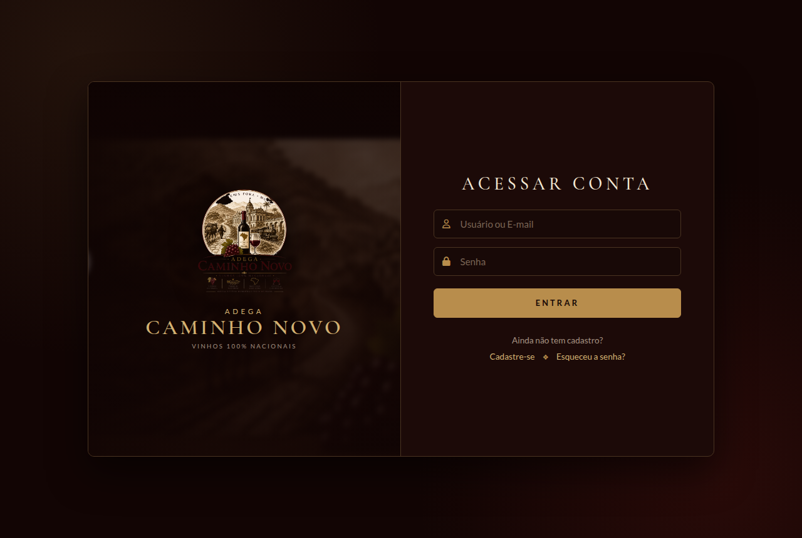
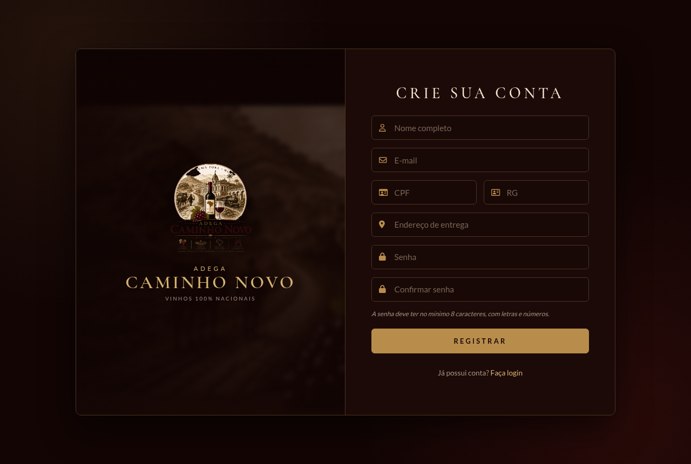
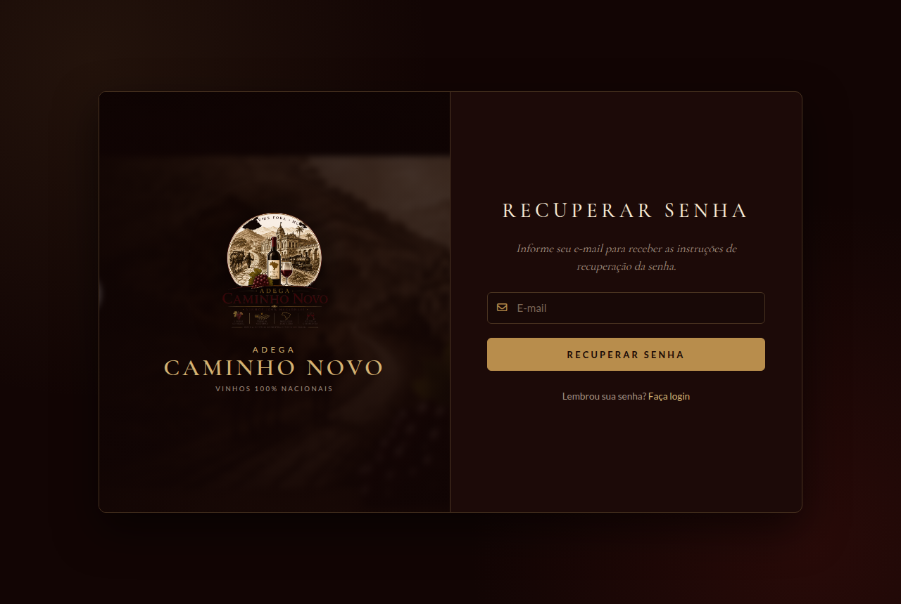
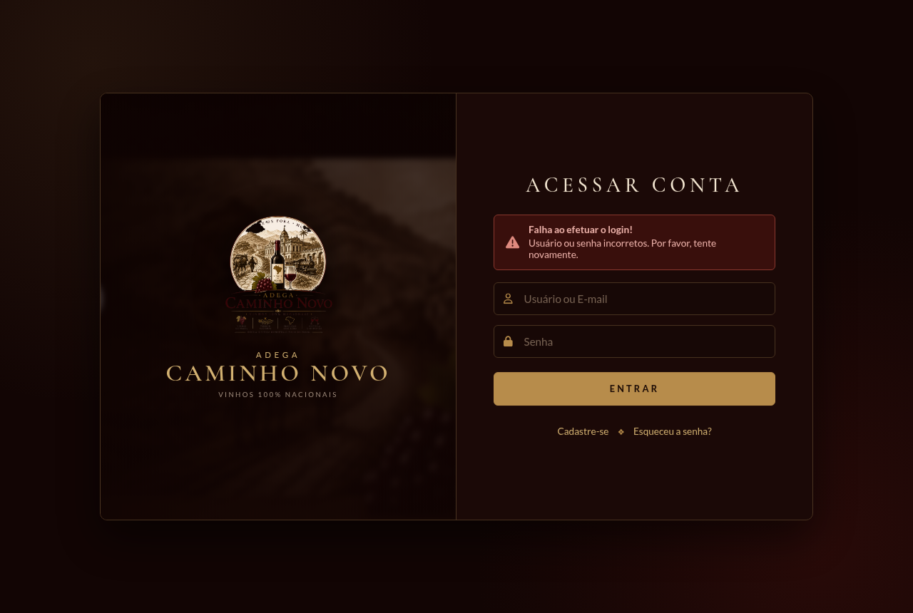
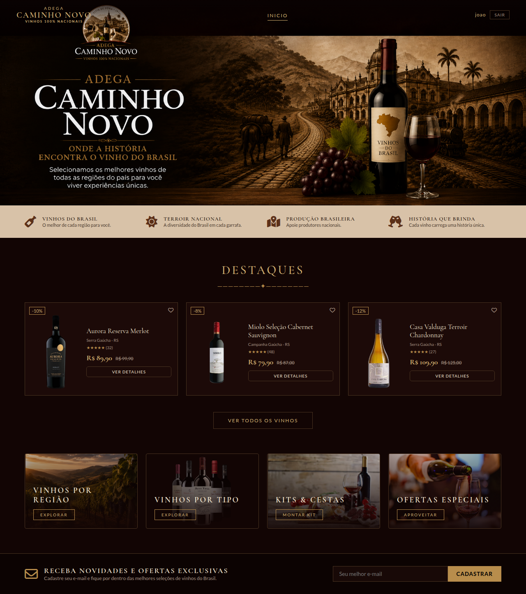

# Adega Caminho Novo — Login e Cadastro de Usuários

Aplicação web desenvolvida com **Spring Boot + Thymeleaf** para a **Atividade 02** da disciplina
*Desenvolvimento e Integração de Aplicações Web* (PUC Minas).

O projeto segue como base o exemplo **SecureLoginPUC_3** do professor: autenticação com Spring
Security, usuários comum e administrador, cadastro de novos usuários e recuperação de senha com
envio de e-mail. As telas usam a identidade visual da Adega Caminho Novo, uma loja fictícia de
vinhos 100% nacionais.

---

## 👥 Dupla

- Enzo Bambirra
- Raiany Morais Ribeiro

---

## 🛠️ Tecnologias

| Recurso | Versão |
| --- | --- |
| Java | 25 |
| Spring Boot | 4.1.1 |
| Maven | wrapper incluso (`./mvnw`) |
| Empacotamento | jar |

**Dependências:** Spring Web MVC, Thymeleaf, Spring Security e Spring Mail (Java Mail Sender).

---

## 📁 Estrutura do Projeto

```text
📁 Site_de_VinhosDIAW
│
├── 📁 src/main
│   ├── ☕ java/com/adega/caminhonovo
│   │   ├── 🚀 application
│   │   │   └── AdegaCaminhoNovoApplication.java   → classe principal
│   │   ├── 🔐 config
│   │   │   ├── SecurityConfig.java                → regras do Spring Security
│   │   │   └── UserConfig.java                    → usuários lidos do application.properties
│   │   ├── 🎮 controller
│   │   │   └── SecureLoginController.java         → rotas da aplicação
│   │   ├── ⚠️ exception
│   │   │   ├── GlobalExceptionHandler.java        → tratamento global de exceções
│   │   │   └── SendEmailException.java            → erro no envio de e-mail
│   │   └── ⚙️ service
│   │       ├── SendEmailService.java              → envio de e-mails
│   │       └── UserService.java                   → cadastro de usuários
│   │
│   └── 📁 resources
│       ├── ⚙️ application.properties
│       ├── 🎨 static
│       │   ├── css      → admin, error, home, login, recoverpassword, register
│       │   └── images   → logo, fundo e imagens dos vinhos
│       └── 🌐 templates
│           ├── admin.html            → área administrativa
│           ├── error.html            → erro de login
│           ├── home.html             → página inicial da loja, exibida após o login
│           ├── login.html            → login
│           ├── recoverpassword.html  → recuperação de senha
│           └── register.html         → cadastro de usuários
│
└── 📄 pom.xml
```

---

## 🌐 Endpoints

| Método | Endpoint | Acesso | Descrição |
| --- | --- | --- | --- |
| `GET` | `/login` | público | Tela de login |
| `POST` | `/login` | público | Processado pelo Spring Security |
| `GET` | `/register` | público | Tela de cadastro |
| `POST` | `/register` | público | Valida e cadastra o usuário |
| `GET` | `/recoverpassword` | público | Tela de recuperação de senha |
| `POST` | `/recoverpassword` | público | Envia o e-mail de recuperação |
| `GET` | `/error` | público | Tela exibida quando o login falha |
| `GET` | `/home` | autenticado | Página inicial da loja, com o usuário logado no topo |
| `GET` | `/admin` | somente `ADMIN` | Área administrativa |
| `POST` | `/logout` | autenticado | Encerra a sessão |

URLs para testar:

- http://localhost:8080/login
- http://localhost:8080/login?logout=true
- http://localhost:8080/home
- http://localhost:8080/admin
- http://localhost:8080/error
- http://localhost:8080/register
- http://localhost:8080/recoverpassword

---

## 🔐 Autenticação

- Os usuários ficam em memória (`InMemoryUserDetailsManager`), e as senhas são gravadas com
  **BCrypt**.
- Dois usuários são criados ao iniciar a aplicação, a partir do `application.properties`:

| Perfil | Usuário | Senha |
| --- | --- | --- |
| Usuário comum | `joao` | `4321` |
| Administrador | `admin` | `1234` |

- Após o login, o administrador é redirecionado para `/admin` e o usuário comum para `/home`.
- Login inválido redireciona para `/error`.
- Usuários cadastrados em `/register` entram com o **e-mail** e a senha escolhida. Como ficam em
  memória, esses cadastros são perdidos quando a aplicação é reiniciada.

### Validações do cadastro

- todos os campos obrigatórios;
- e-mail em formato válido;
- senha com no mínimo 8 caracteres, com letras e números;
- senha e confirmação iguais;
- e-mail ainda não cadastrado.

---

## ▶️ Como executar

Pré-requisito: **JDK 25** instalado.

```bash
git clone https://github.com/Raiany046/Site_de_VinhosDIAW.git
cd Site_de_VinhosDIAW
./mvnw spring-boot:run
```

No Windows, use `mvnw.cmd spring-boot:run`. A aplicação sobe em http://localhost:8080/login.

---

## ⚙️ Configuração do application.properties

```properties
spring.application.name=Adega Caminho Novo
app.user.username=joao
app.user.password=4321
app.admin.username=admin
app.admin.password=1234
spring.mail.host=smtp.gmail.com
spring.mail.port=587
spring.mail.username=${MAIL_USERNAME:}
spring.mail.password=${MAIL_PASSWORD:}
spring.mail.properties.mail.smtp.auth=true
spring.mail.properties.mail.smtp.starttls.enable=true
spring.mail.properties.mail.smtp.starttls.required=true
```

### 🔑 Credenciais do e-mail

O e-mail e a senha usados no envio **não ficam no código**. Eles são lidos das variáveis de
ambiente `MAIL_USERNAME` e `MAIL_PASSWORD`.

1. Ative a verificação em duas etapas na conta Gmail.
2. Gere uma **senha de app** em https://myaccount.google.com/apppasswords.
3. Defina as variáveis antes de rodar a aplicação:

```bash
export MAIL_USERNAME=seuemail@gmail.com
export MAIL_PASSWORD=suasenhadeapp
./mvnw spring-boot:run
```

No Windows (PowerShell):

```powershell
$env:MAIL_USERNAME="seuemail@gmail.com"
$env:MAIL_PASSWORD="suasenhadeapp"
.\mvnw.cmd spring-boot:run
```

Sem essas variáveis a aplicação funciona normalmente, mas a recuperação de senha retorna erro
ao tentar enviar o e-mail.

---

## 🖼️ Telas

|  |
|:---:|
| Login |

|  |
|:---:|
| Register |

|  |
|:---:|
| Recover Password |

|  |
|:---:|
| Error |

|  |
|:---:|
| Home |

|  |
|:---:|
| Admin |
